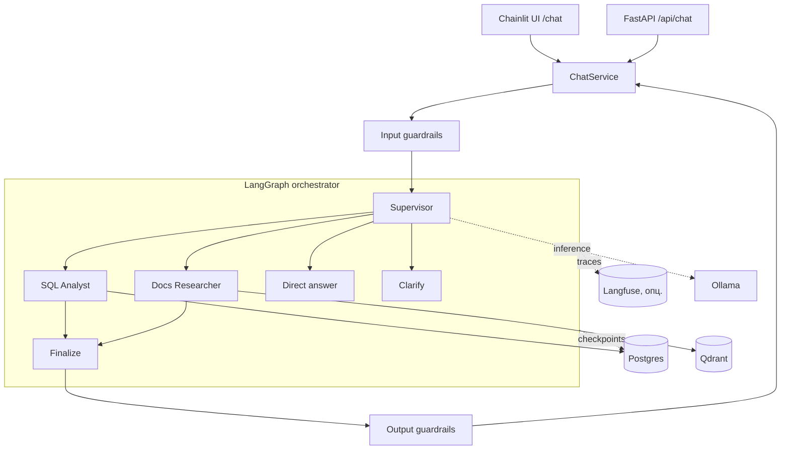
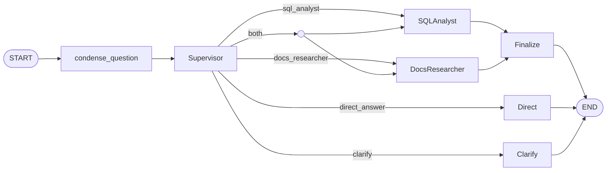

# AI Financial Analyst

Read-only аналитический ассистент для личного кабинета компании-партнёра BaaS-платформы.
Отвечает финансовым специалистам на вопросы поверх их транзакций, лимитов, тарифов и
внутренних регламентов — со ссылками на источники и, при необходимости, с черновиком
действия для ручного подтверждения.

Ассистент **не двигает деньги и ничего не исполняет сам**: он только читает данные, ищет
по документам и предлагает. Любое действие (выгрузка отчёта, тикет, акт) возвращается как
draft с флагом `requires_confirmation`.

## Сценарий

Оператор (BaaS-платформа) хостит одну инсталляцию на несколько компаний-партнёров. Каждый
пользователь работает только в контуре своей компании — это жёсткое требование, а не
соглашение. Финансовый менеджер, бухгалтер, финдир или внутренний аудитор спрашивает
обычным языком:

- «Сколько потратили на командировки за последние 90 дней?»
- «Какой лимит на корпкарту у топ-менеджеров по регламенту?»
- «Сравни наши расходы на отели с лимитами из политики.»
- «Правильно ли начислена комиссия за payout?»

Под капотом вопрос проходит через guardrails, супервайзер выбирает маршрут (данные,
документы, оба сразу или уточнение), специалисты собирают ответ, и финализатор склеивает
его с источниками.

## Что умеет

- **Аналитика по транзакциям** — генерация SQL, выполнение, интерпретация результата на
  русском. ReAct-цикл с самокоррекцией ошибок БД (до 3 попыток).
- **Поиск по регламентам** — гибридный retrieval (dense + sparse BM25, RRF) с
  cross-encoder reranking поверх корпуса из 18 документов.
- **Маршрутизация** — супервайзер разводит вопрос по специалистам, при `both` оба работают
  параллельно, при нехватке данных просит уточнить.
- **Multi-tenant изоляция** — пользователь компании A никогда не видит данных компании B.
- **Draft-действия** — `export_report`, `open_ticket`, `prepare_act`,
  `highlight_discrepancy`, всегда как предложение, а не исполнение.
- **Multi-turn** — история диалога живёт в чекпоинтах LangGraph, follow-up учитывает контекст.
- **Guardrails** — детекция prompt injection, маскирование PII, защита от cross-tenant
  утечки в ответе.

## Архитектура

FastAPI — основной backend (entrypoint, lifespan, `/health`, `/ready`, REST). Chainlit
смонтирован в тот же процесс на `/chat` и работает только как UI-слой. Вся AI-логика живёт
за `ChatService` — единой точкой входа в граф, общей для REST и UI. Ядро системы не
импортирует Chainlit: UI можно убрать, не трогая backend.



### Граф агента



SQL Analyst — это вложенный subgraph с собственным ReAct-циклом: `generate_sql → execute →
interpret`, а при ошибке БД возвращается к генерации с текстом ошибки в контексте. Docs
Researcher — линейный: `retrieve → rerank → summarize`.

## Стек

| Слой | Технология |
|------|-----------|
| Язык | Python 3.12 (управление через `uv`) |
| API | FastAPI + `uvicorn` |
| UI | Chainlit (mounted на `/chat`) |
| Оркестрация | LangGraph + `langgraph-checkpoint-postgres` |
| LLM | Qwen2.5 через Ollama; модель настраивается per-роль через env |
| Embeddings | BGE-M3 (dense + sparse одной моделью) |
| Reranker | bge-reranker-v2-m3 (cross-encoder) |
| Vector DB | Qdrant (hybrid search) |
| RDBMS | Postgres 16 (данные + чекпоинты + FX-кеш + audit log) |
| SQL parsing | sqlglot |
| Observability | Langfuse (self-hosted, опционально) |
| Logging | structlog |

LLM-модели заданы в `.env` отдельно для супервайзера, специалистов и финализатора, так что
можно гонять разные модели под разные роли или менять их без правок кода. Ollama запускается
на хосте; остальная инфраструктура — в docker-compose.

## Быстрый старт

Нужны: Docker + Docker Compose, [`uv`](https://docs.astral.sh/uv/) и
[Ollama](https://ollama.com/) на хосте.

```bash
# 1. Конфигурация
cp .env.example .env

# 2. Инфраструктура (postgres + qdrant)
make up

# 3. Зависимости
make install

# 4. Модель в Ollama (см. LLM_*_MODEL в .env)
ollama pull qwen2.5:3b-instruct

# 5. Схема БД и данные по 3 компаниям-партнёрам
make migrate
make seed

# 6. Индексация корпуса документов в Qdrant
make ingest

# 7. Запуск
make run
```

UI откроется на `http://localhost:8000/chat`, REST — на `POST /api/chat`. Перед сессией в
Chainlit выбирается профиль вида `ACME LLC · CFO` — это идентичность пользователя
(компания + роль), как если бы она пришла из auth-токена в продукте.

`make seed` наполняет БД тремя компаниями-партнёрами с неравномерным распределением
(`ACME LLC`, `Ostrovok-mock`, `CheckScan-mock`) — около 5000 транзакций, у каждой свой
профиль трат. Корпус — 13 общих регламентов оператора и 5 внутренних документов конкретных
партнёров.

## Структура репозитория

```
app/
  api/            # FastAPI routes, схемы, DI
  services/       # ChatService — единый вход в граф; tenants_view для UI
  ui/             # Chainlit handlers (только UI, не импортирует ядро)
  graph/          # LangGraph: supervisor, специалисты, finalize, build
  tools/          # sql_guard, sql_executor, calculator, currency_convert, draft actions
  rag/            # chunker, embedder, retriever, reranker, ingest, qdrant_store
  guardrails/     # input/output guards, паттерны, tenant index
  observability/  # structlog config, Langfuse handler
  db/             # SQLAlchemy models, session, seed, checkpointer
  main.py         # FastAPI app + lifespan + mount_chainlit
prompts/          # промпты отдельными файлами
docs/             # корпус регламентов (shared + tenant-scoped)
eval/             # golden dataset + runner + метрики
tests/            # unit-тесты (guard, tools, guardrails, routing, ...)
```

## Multi-tenant изоляция

Изоляция держится на уровне приложения, в двух точках:

- **SQL guard** разбирает каждый запрос через AST (sqlglot) и для всех tenancy-aware таблиц
  инжектит `WHERE company_id = <id пользователя>`. Если модель попробовала подставить чужой
  `company_id` — guard перезаписывает его и пишет инцидент в `audit_log`. Запрос без
  tenant-фильтра к такой таблице отклоняется, а не «молча чинится». Разрешён только `SELECT`;
  список таблиц и чувствительных колонок зависит от роли.
- **RAG payload filter** в Qdrant фильтрует чанки по `tenant_scope` и `access_roles` прямо на
  стадии retrieval, а не пост-фактум. Shared-документы помечены `tenant:*`, внутренние —
  `tenant:<slug>`.

Поверх этого output guardrail режектит ответ, если в нём всплыл чужой `company_id` или имя
чужой компании-партнёра. Postgres RLS как defense-in-depth сознательно оставлен за рамками
(см. «Что дальше»).

## Guardrails

- **Вход**: блоклист prompt-injection паттернов, маскирование PII (номера карт по Луну, ИНН),
  лимит длины вопроса.
- **Выход**: проверка на cross-tenant утечку, маскирование номеров карт до `**** last4`,
  гарантия `requires_confirmation=true` на любом draft-действии.

Cross-tenant сценарии вынесены в отдельный red-team набор тестов — это обязательная, а не
опциональная часть.

## Evaluation

В `eval/` лежит golden dataset и runner, который поднимает тот же граф, что и приложение, и
гоняет кейсы end-to-end. Метрики считаются в трёх группах:

- **Агентные**: точность маршрутизации, корректность SQL (assertions + реальное выполнение),
  правильный набор tools, корректность draft-действий, отсутствие cross-tenant утечки.
- **RAG / качество ответа** (LLM-as-judge): faithfulness, релевантность ответа, precision
  контекста, совпадение с эталоном.
- **Операционные**: latency p50 / p95.

```bash
make eval        # полный прогон + JSON-отчёт в eval/reports/
make eval-fast   # только route_accuracy (быстрый smoke)
make eval-rag    # только LLM-as-judge метрики
```

Распределение кейсов покрывает SQL-only, RAG-only, оба специалиста сразу,
answer + draft-action, clarify / direct и отдельный cross-tenant red-team блок.

## Observability

Логи — структурированные (structlog, JSON или console через `LOG_FORMAT`), с per-request
контекстом (`thread_id`, `user_id`, `user_role`, `company_id`), который наследуется всеми
узлами графа. Все SQL-запросы пишутся в `audit_log` с нормализованным текстом, числом строк,
длительностью и пометкой инцидентов.

Langfuse опционален и выключен по умолчанию. Включается так:

```bash
make up-obs                  # langfuse + clickhouse + minio + redis
# затем ENABLE_LANGFUSE=true в .env
```

Тогда в Langfuse UI (`:3000`) видны трейсы, токены, latency и tool calls по каждому запросу.

## Конфигурация

Весь конфиг — через `.env` (Pydantic Settings). Полный список с комментариями — в
`.env.example`. Ключевое: модели LLM per-роль, параметры retrieval и rerank, лимиты и таймаут
SQL, TTL FX-кеша, флаги Langfuse.

## Ключевые решения и trade-offs

| Решение | Альтернатива | Почему так |
|---------|--------------|------------|
| Tenant-изоляция на уровне приложения (SQL guard + Qdrant filter) | Postgres RLS | guard покрывает demo-контур; RLS — defense-in-depth для прода |
| Chainlit смонтирован в FastAPI-процесс | Отдельный UI-сервис | один процесс, один порт, общие singletons, без сетевого hop'а |
| Вся role-scoped схема в промпт | Schema retriever | при 12 таблицах схема (~5–7 KB) влезает в контекст; retriever — оверкилл |
| Ручной парсинг JSON-маршрута + fallback | `with_structured_output` | предсказуемее на локальных моделях; жёсткий контракт + один re-prompt |
| Ollama локально | Hosted API / vLLM | воспроизводимость без внешних ключей и затрат |
| Draft-only действия | Авто-исполнение | ассистент остаётся read-only; исполнение — за пользователем |

## Что дальше (production)

- **Postgres RLS** поверх application-level guard и отдельная read-only роль БД для запросов
  агента — defense-in-depth.
- **vLLM с continuous batching** вместо Ollama под нагрузку; **каскад моделей** — лёгкая на
  маршрутизации, тяжёлая на сложных кейсах.
- **Подключение FX и calculator** как полноценных LLM-tools в SQL Analyst (сейчас граф их не
  вызывает).
- **Hallucination self-check** отдельным проходом перед выдачей ответа.
- **Self-service onboarding** компаний-партнёров через API оператора вместо seed-скрипта.
- **Деплой в K8s** (Helm + HPA по глубине очереди) вместо docker-compose.
